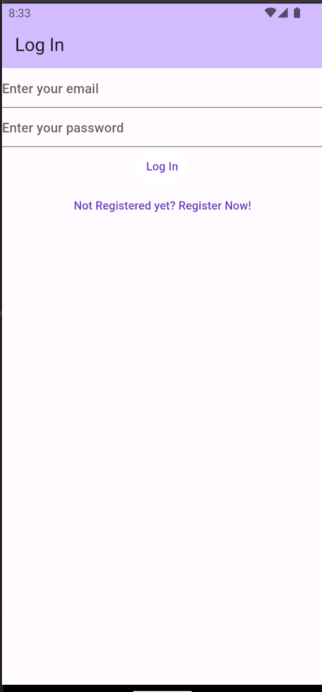
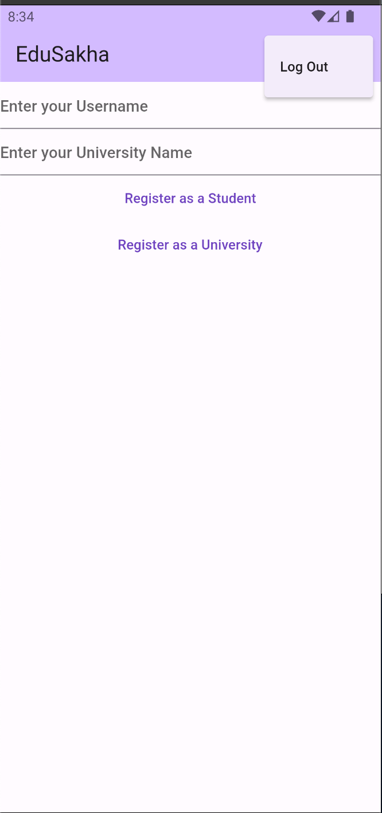
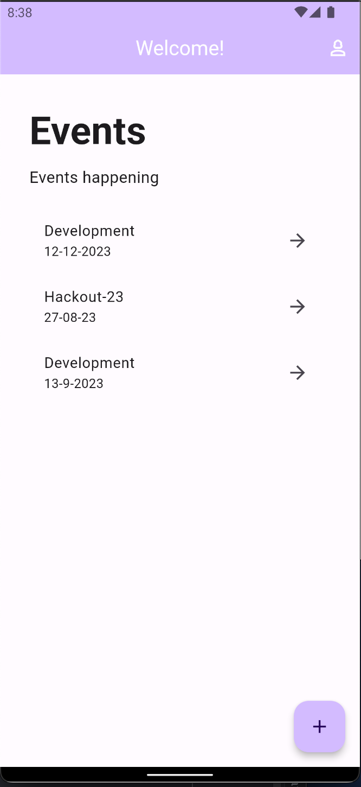
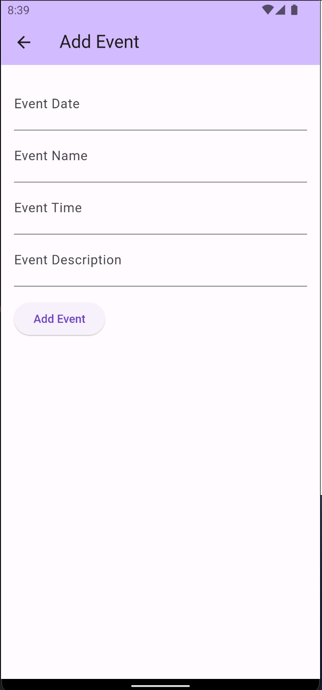
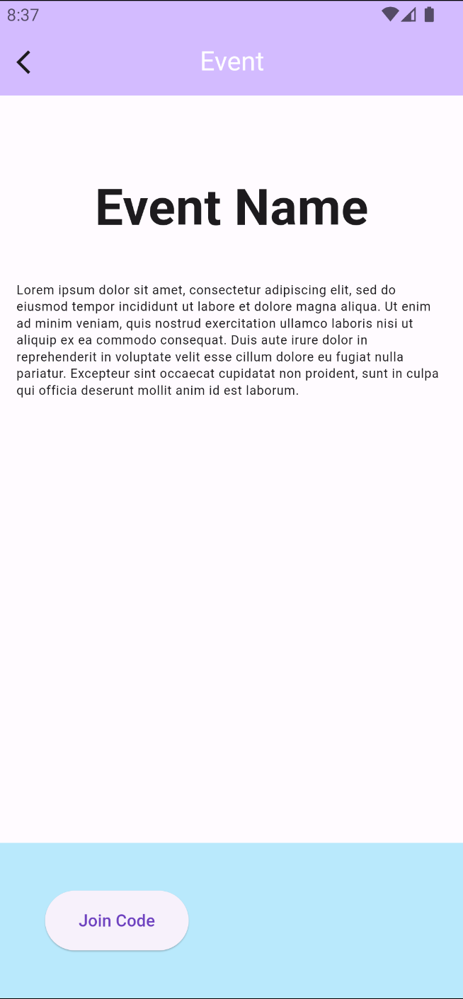
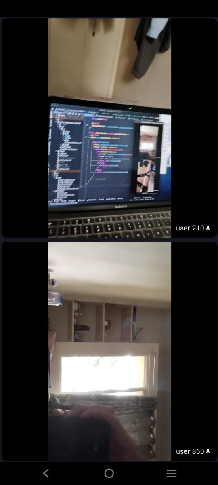
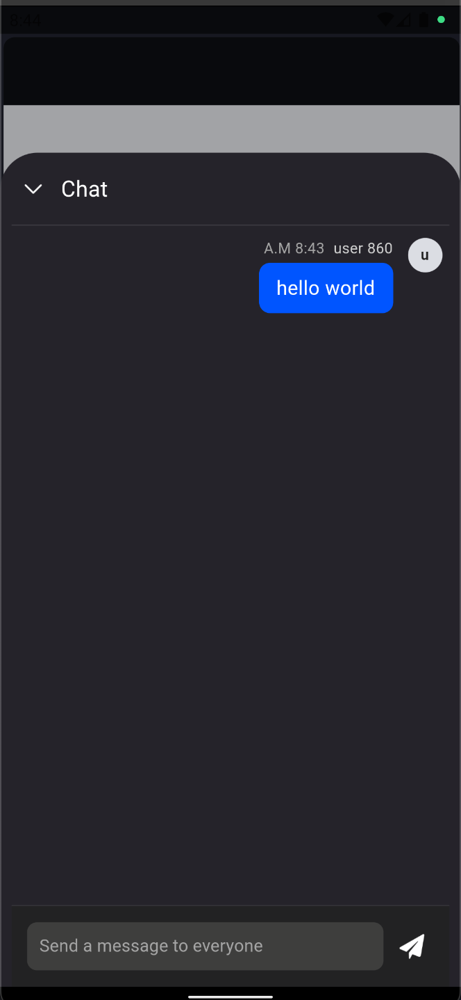
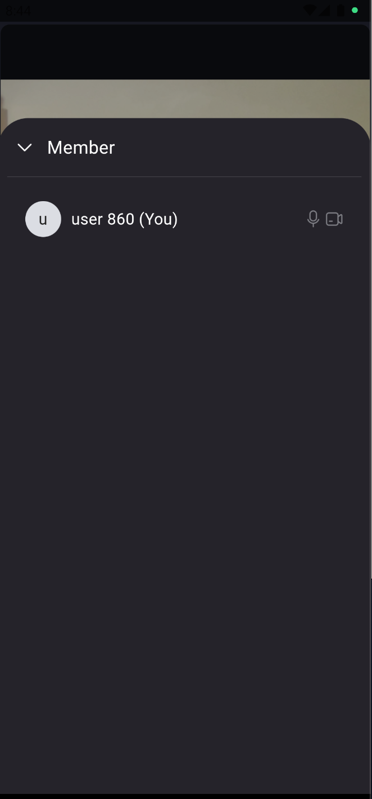

# Edusakha

An app in Flutter which helps in providing a platform for
the students to view upcoming events, attend webinars hosted by institutions,
ask doubts in them, review the recorded lectures and discuss among peer
students.
On the other hand, the institutions can also schedule meetings and view the
analytics of the students attendance.
All this is possible with the help of Flutter, Firebase and Zego-UIKit.

## Basic features of the app

❖ Login Page for both students and institutions with Authentication in Firebase

❖ Upcoming events/webinars displayed on the home page 

❖ Students attend conferences with teachers and can ask their 
doubts in the chat section also they can speak with the permission of Host.

❖ Recorded webinar videos for viewing later(To be implemented)

❖ The institution can view the analytics of the students(To be implemented)

❖ Few screenshots are shown below

  
  
  
  
  
  
  
  

❖ This application was build during a HackOut'23 and development time for this app is less than 30hrs :)

❖ Built with Love using Flutter 💙 and special thanks to my team - @Riddhi-1510 and @10maysingh
